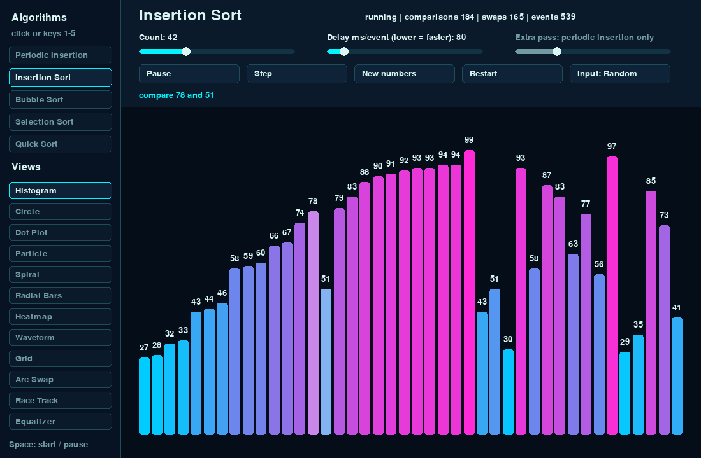

# Sorting Visualizer

Watch five sorting algorithms work step by step: every comparison and swap is drawn, counted and shown on screen.
Written in Python with pygame.



Blog post with explanations and measured comparison counts:
[Sorting algorithms, visualized in Python](https://zayunsna.github.io/blog/2026-10-12-sorting_algorithms_visualized/)

## Run it

```bash
git clone https://github.com/zayunsna/sorting-visualizer.git
cd sorting-visualizer
python3 -m pip install -r requirements.txt
./run.sh            # or: python3 sort_visualizer.py
```

Tested with Python 3.13 and pygame 2.6.1 on macOS.

## Controls

| Key / button | Action |
|---|---|
| `1`–`5` or click | Choose the algorithm |
| `Space` / Start | Start, pause, replay |
| `→` / Step | One event at a time |
| `R` / Restart | Same numbers, start again |
| `N` / New numbers | New random numbers |
| Input button | Random, Reversed, Sorted, Few unique |
| `↑` `↓` / Delay slider | Faster or slower |
| `V` or click | Switch between 12 views (histogram, circle, spiral, …) |
| `Esc` | Quit |

## Algorithms

- Insertion sort
- Bubble sort
- Selection sort
- Quick sort (last element as pivot)
- Periodic insertion: insertion sort with an extra bubble pass every N insertions. Not a standard algorithm; it is here to show that the extra pass costs comparisons without saving any swaps.

## How it works

Each algorithm is a Python generator. It sorts the list in place and `yield`s a small `SortEvent`
(`compare`, `swap`, `pivot`, …) at every step. The window pulls events and draws them, so the
algorithm code stays free of any drawing code. Simplified:

```python
def bubble_sort(arr):
    for end in range(len(arr) - 1, 0, -1):
        for i in range(end):
            yield SortEvent("compare", i, i + 1)
            if arr[i] > arr[i + 1]:
                yield SortEvent("swap", i, i + 1)
                arr[i], arr[i + 1] = arr[i + 1], arr[i]
```

To add your own algorithm, write a generator like this and add it to `ALGORITHMS`.

## Test

```bash
python3 test_sorts.py   # every algorithm x 4 input types x 6 sizes, checked against sorted()
```

## License

MIT
